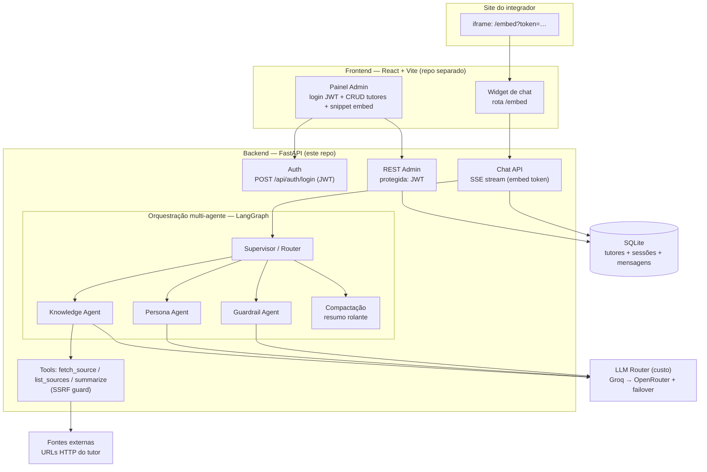

# Magister, backend

Backend do **Magister**, plataforma B2B onde administradores criam tutores de IA
(persona, instrucoes, fontes) e integradores os embutem em sites via `<iframe>`.

> Codigo produzido **via agentes de codificacao** (agentes backend, frontend e
> seguranca), conforme exigido pelo PRD do desafio. Este repositorio e o do backend.

## Arquitetura



## Stack

- **FastAPI** + **SQLModel/SQLAlchemy** sobre **SQLite**.
- Orquestracao **LangChain + LangGraph** (`StateGraph`), multi-agente.
- Conhecimento **agentico por tools** (`list_sources`, `fetch_source`, `summarize`).
  Sem vector DB / embeddings (restricao do PRD).
- Auth admin por **JWT**; widget por **embed token** publico escopado ao tutor.
- Chat por **SSE**; roteamento de LLM por custo (Groq -> OpenRouter) com failover.

## Decisoes de arquitetura

| Tema | Decisao | Porque |
|---|---|---|
| Orquestracao | LangGraph `StateGraph` multi-agente | Roteamento dinamico + especialistas (Supervisor/Knowledge/Persona/Guardrail), extensivel |
| Conhecimento | Tools que buscam/resumem URLs | PRD proibe vector DB/embeddings |
| Banco | SQLite | Zero-config para o MVP; migrar para Postgres e trivial |
| Auth | JWT (admin) + embed token (widget) | Expiracao + role no admin; embed token e publico e escopado, sem segredo no front |
| Transporte | HTTP + SSE | Simples e funciona bem em iframe |
| Memoria | Janela de 40 msgs + resumo rolante | Continuidade sem estourar contexto |
| LLM | Router por custo com failover | Free/barato primeiro (Groq), fallback (OpenRouter) |

### Topologia do grafo

```
guardrail_input -> supervisor -> [knowledge?] -> compaction -> persona -> guardrail_output
```

- **guardrail_input**: barra prompt-injection (regex) antes de gastar LLM.
- **supervisor**: decide se precisa buscar conhecimento (heuristica barata).
- **knowledge**: usa as tools (whitelist) sobre `tutor.sources`, com SSRF guard.
- **compaction**: resumo rolante quando a janela de 40 mensagens enche.
- **persona**: gera a resposta com `system_instructions` + contexto + historico.
- **guardrail_output**: evita vazamento do bloco de seguranca.

Estado compartilhado: `{tutor, user_message, history, rolling_summary,
compiled_context, needs_knowledge, response, tokens_used, safety}`.

## Como subir localmente

```bash
cd backend
python -m venv .venv
# Windows: .venv\Scripts\activate | Unix: source .venv/bin/activate
pip install -e ".[dev]"

cp .env.example .env            # preencha os valores (veja abaixo)
# gere o hash da senha do admin:
python -c "import bcrypt;print(bcrypt.hashpw(b'suasenha',bcrypt.gensalt()).decode())"

uvicorn app.main:app --reload
```

API em `http://localhost:8000` (docs em `/docs`, health em `/health`).

### Variaveis de ambiente (`.env.example`)

| Variavel | Descricao |
|---|---|
| `JWT_SECRET` | Segredo HS256 do JWT admin (use 32+ bytes) |
| `JWT_EXPIRE_MINUTES` | Expiracao do token (padrao 60) |
| `ADMIN_USERNAME` / `ADMIN_PASSWORD_HASH` | Credencial do admin unico (hash bcrypt) |
| `DATABASE_URL` | Conexao SQLite |
| `CORS_ALLOW_ORIGINS` | Origens do painel admin (separadas por virgula) |
| `HISTORY_WINDOW` | Tamanho da janela de mensagens (padrao 40) |
| `MAX_OUTPUT_TOKENS` | Teto de tokens por resposta |
| `MAX_TOKENS_PER_SESSION` | Orcamento de tokens por sessao |
| `CHAT_RATE_LIMIT_PER_MIN` | Rate limit da rota de chat por token/IP |
| `FETCH_TIMEOUT_SECONDS` / `FETCH_MAX_BYTES` | Limites do `fetch_source` (SSRF) |
| `LLM_PROVIDERS` | Lista JSON ordenada por custo (Groq -> OpenRouter) |
| `LLM_TASK_MODELS` | Mapa opcional tarefa->modelo (guardrail/summarize baratos) |

Chaves de LLM e `JWT_SECRET` vivem **so** no backend. O `.env.example` nao tem
valores reais; `.env` e ignorado pelo git.

## Rotas

| Metodo | Rota | Auth | Descricao |
|---|---|---|---|
| POST | `/api/auth/login` | - | Login admin -> JWT |
| POST | `/api/tutors` | JWT | Cria tutor |
| GET | `/api/tutors` | JWT | Lista tutores |
| GET | `/api/tutors/{id}` | JWT | Detalhe |
| PUT | `/api/tutors/{id}` | JWT | Atualiza |
| PATCH | `/api/tutors/{id}/status` | JWT | Ativa/desativa |
| GET | `/api/tutors/{id}/embed` | JWT | Snippet `<iframe>` + embed token |
| GET | `/api/embed/{embed_token}` | publica | Config publica do widget (titulo + saudacao) |
| POST | `/api/chat` | embed token | Chat do widget (SSE) |

### Fluxo de embed ponta a ponta

1. Admin faz `POST /api/auth/login` e recebe o JWT.
2. Cria um tutor (`POST /api/tutors`); o servidor gera o `embed_token`.
3. `GET /api/tutors/{id}/embed` retorna o snippet
   `<iframe src=".../embed?token=<embed_token>">`.
4. O integrador cola o snippet no site. O widget (frontend) chama
   `POST /api/chat {embed_token, message}`; o backend valida tutor ativo +
   origem, aplica rate limit e orcamento de tokens, roda o grafo e faz stream SSE.

## Seguranca

Ver `SECURITY.md`. Resumo do que este backend implementa:

- Segredos so por env; `.gitignore` + `.gitleaks.toml` + hook `pre-commit`.
- CRUD admin exige JWT (assinatura + expiracao + role); widget usa so o embed token.
- Rate limit em `/api/chat` (token/IP) + orcamento de tokens por sessao.
- Handler global de erro sem vazar stack trace; logs estruturados (JSON).
- Bloco anti prompt-injection no system prompt; whitelist de tools.
- SSRF guard no `fetch_source` (so http/https; bloqueia IPs privados/loopback/
  link-local, incluindo `169.254.169.254`; timeout e limite de tamanho).

## Testes e lint

```bash
ruff check .
pytest
```

## Limitacoes do MVP

- Rate limit em memoria (1 instancia). Producao: Redis/WAF (ver `SECURITY.md`).
- SSE entrega a resposta ja gerada em blocos; streaming token a token direto do
  modelo fica como proximo passo (o transporte SSE ja esta pronto).
- Admin unico via env (sem tabela de usuarios / refresh token).
- CSP `frame-ancestors` da pagina do widget e responsabilidade do frontend.
